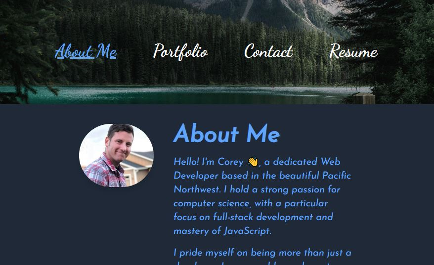
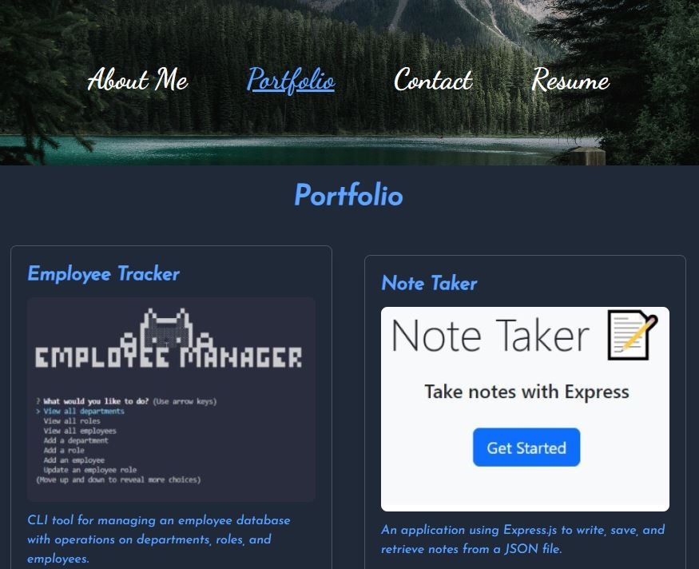
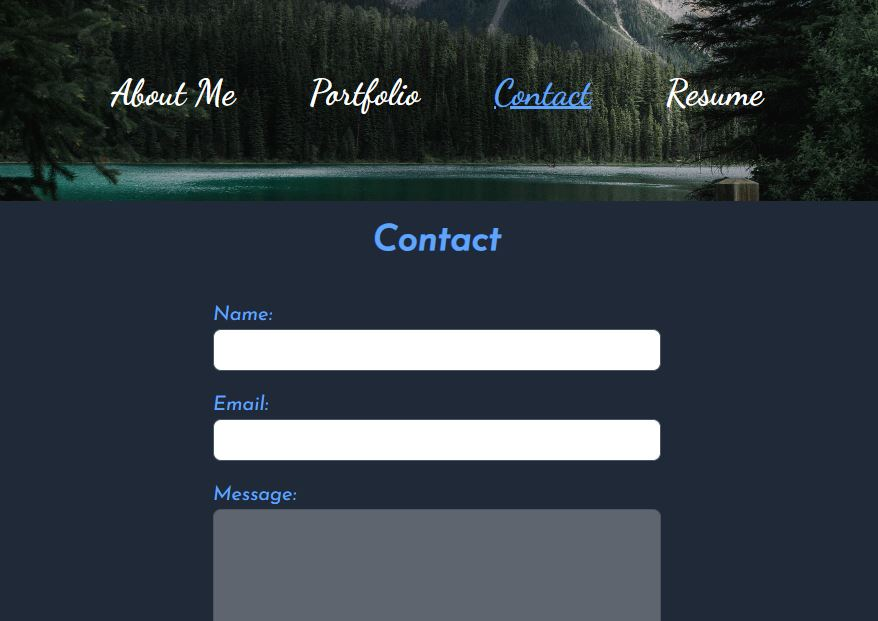
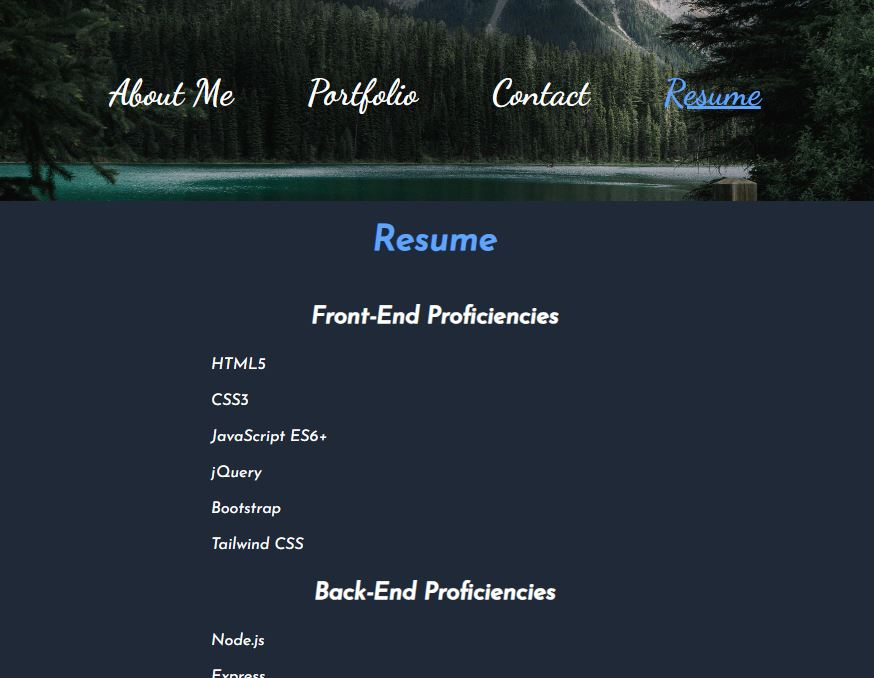

# React Portfolio


## Description

This is a portfolio application built using React.js. It showcases professional information, skills, work samples, and contact details.

## Features

- About Me: A personal introduction and brief overview of my professional background.
- Portfolio: A collection of projects and applications I've created or contributed to.
- Contact: A contact form for visitors to send messages.
- Resume: An overview of my education, skills, and experience.

## Technology Stack
- React.js: The entire application is built with React.js.
- React Router: Used for routing within the application.
- Tailwind CSS: Used for styling the application.
- React Helmet: Used to manage the meta-tags of the document head.

## Project Setup

To run this project locally, follow the steps below:

- Clone the repository: ``` git clone https://github.com/spamdalfz/react-portfolio.git ```
- Navigate into the directory: ```cd react-portfolio```
- Install the dependencies: ```npm install```
- Start the development server: ```npm start```
- You can now access the application on http://localhost:3000.

## Deployment

The application is deployed on GitHub Pages. The deployment is managed with the gh-pages package. The static files are built using the npm run build command, and then pushed to the gh-pages branch with gh-pages -d build.

View the app live [here](https://spamdalfz.github.io/react-portfolio/).

## Screenshots

### About page


### Portfolio page


### Contact page


### Resume page



## License

This project is licensed under the MIT license. Click [here](https://opensource.org/licenses/MIT) for more information.

## Contributing

If you have suggestions for how this project could be improved, or want to report a bug, open an issue. Contributions are always welcome.

## Tests

Currently, there are no automated tests for this application. Testing is performed manually.

## Questions

If you have any questions, you can reach out to me on [GitHub](https://github.com/spamdalfz) or contact me directly at coreyvasser@gmail.com.